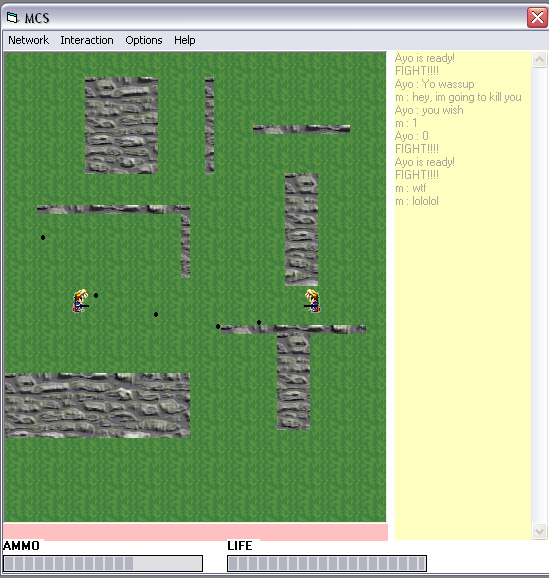



## \[Multishoot\] \- UDP Multiplayer Shooter

### Description

This is a multiplayer game in UDP Winsock, i use BitBlt to make it nicer. You have two animated characters going around shooting each other - that means bullets, mines, walls... The code itself is very flexible, its very easy to modify the map, only move rectangles around the form, or add some more, or erase some... I tried to pack in it the most useful features that you would need for Winsock programming... And how to use winsock to your advantage.
 
### More Info
 

             |
---                |---
**Submitted On**   |2004-12-07 19:09:00
**By**             |[Mephisto](https://github.com/Planet-Source-Code/PSCIndex/blob/master/ByAuthor/mephisto.md)
**Level**          |Advanced
**User Rating**    |5.0 (15 globes from 3 users)
**Compatibility**  |VB 6\.0
**Category**       |[Games](https://github.com/Planet-Source-Code/PSCIndex/blob/master/ByCategory/games__1-38.md)
**World**          |[Visual Basic](https://github.com/Planet-Source-Code/PSCIndex/blob/master/ByWorld/visual-basic.md)
**Archive File**   |[\[Multishoo18341212282004\.zip](https://github.com/Planet-Source-Code/mephisto-multishoot-udp-multiplayer-shooter__1-57946/archive/master.zip)

